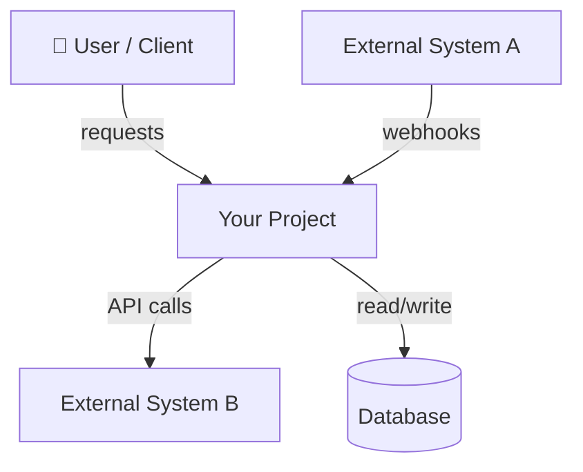

# /initialize — Initialize Project Overview

You are performing a project initialization scan. Your goal: produce a concise, high-level project overview so any AI agent can quickly understand this project's big picture. This is a **shallow, wide** scan — what the project IS and what it DOES, not how each piece works internally.

**Output:** `.workflow/project-overview.md` (max ~4k tokens, loaded on every session via CLAUDE.md)

## Step 1: Discovery

Perform ALL of the following scans. This process is **language-agnostic** — adapt your investigation based on what you find, don't assume any specific framework.

### 1a. Detect Project Type
- Scan for manifest files: `package.json`, `composer.json`, `Gemfile`, `requirements.txt`, `pyproject.toml`, `Cargo.toml`, `go.mod`, `pom.xml`, `build.gradle`, `CMakeLists.txt`, `*.csproj`, etc.
- If multiple manifests: identify primary vs supporting (e.g., monorepo with multiple packages)
- If none found: scan file extensions to infer language(s)

### 1b. Scan Project Structure
- List top-level directories
- Identify common patterns: `src/`, `lib/`, `app/`, `pkg/`, `internal/`, `cmd/`, `tests/`, `docs/`, `config/`, `scripts/`, `migrations/`, etc.
- Note: project structure conventions vary by ecosystem — don't assume

### 1c. Read Existing Documentation
- Read `README.md`, `CONTRIBUTING.md`, any `docs/` directory (skim, don't deep-dive)
- Read any architecture decision records (ADRs) if present
- Skip `CLAUDE.md` (that's ours)

### 1d. Read Configuration Files
- Build/compile config: tsconfig, webpack, vite, Makefile, Dockerfile, etc.
- Linting/formatting: eslint, prettier, rubocop, flake8, etc.
- CI/CD: `.github/workflows/`, `.gitlab-ci.yml`, `Jenkinsfile`, etc.
- Infrastructure: `docker-compose.yml`, terraform, k8s manifests, etc.

### 1e. Read Entry Points
Identify main entry file(s) by ecosystem convention:
- JS/TS: `index.ts`, `main.ts`, `app.ts`, `server.ts`
- Python: `main.py`, `app.py`, `__main__.py`, `manage.py`, `wsgi.py`
- Go: `main.go`, `cmd/*/main.go`
- Rust: `main.rs`, `lib.rs`
- Java/Kotlin: `*Application.java`, `*Application.kt`
- C#: `Program.cs`, `Startup.cs`
- Other: look for main/entry pattern in manifest

Read 2-3 representative source files to understand coding style.

### 1f. Read Routing/API Surface (if applicable)
- Web: route definitions, controller files, API specs (OpenAPI, etc.)
- CLI: command definitions, argument parsers
- Library: public exports, module index

### 1g. Read Database Schema (if applicable)
- Migration files, schema definitions, ORM models
- Identify main entities and their relationships (high-level — main tables, not every column)
- Note the database type (relational, document, graph, etc.)

### 1h. Identify Core User Flows
- From routes, controllers, and entry points: identify the 3-5 most important things the system does
- Trace each flow at a high level: what triggers it, what steps happen, what's the output
- Note side effects (sends email, charges payment, writes audit log, publishes event)
- Do NOT trace failure/recovery details — that's `/analyze` depth

## Step 2: Analysis

From everything discovered, identify:
- Language(s), frameworks, key libraries/dependencies
- Architectural pattern (monolith, microservices, modular monolith, hexagonal, MVC, CQRS, event-driven, serverless, etc.)
- Project topology (single app, monorepo, library, CLI tool, API service)
- How modules/domains are organized and their responsibilities
- **Core user flows** — the 3-5 most important things the system does, traced at a high level
- **Main data model** — key entities and their relationships (not every column, just the shape)
- **System context** — what's outside this system (users, external services, inputs, outputs)
- Data flow — how data enters, transforms, and exits the system
- External integrations (databases, APIs, message queues, caches)
- Authentication / authorization pattern (if applicable)
- Testing setup (framework, test location convention, how to run)
- Build / deploy pipeline
- Coding conventions (naming, file structure, import patterns, error handling)

## Step 3: Write `project-overview.md`

Write the output to `.workflow/project-overview.md` using the format below.

**Rules:**
- Max ~4k tokens. Every token earns its place — concise and complete.
- **Diagrams are MANDATORY** — system context, architecture, data flow, and ER diagrams. Use Mermaid syntax.
- Use tables for structured data — maximum information density per token.
- **Adaptive sections** — omit sections that don't apply (no "Routing Strategy" for a CLI tool, no "Core Flows" for a utility library).
- A simple CLI tool might need 800 tokens. A complex service might need 3.5k. Don't pad.

### Output Format

```markdown
---
project: {name}
type: {web-app | api-service | cli-tool | library | monorepo | mobile-app}
last_updated: {YYYY-MM-DD}
languages: [{languages}]
frameworks: [{frameworks}]
---

## What This Project Does
{2-3 sentences — what problem it solves, who uses it, key use cases}

## Tech Stack & Key Dependencies
| Category | Technology | Purpose |
|----------|-----------|---------|
| Language | ... | ... |
| Framework | ... | ... |
| Database | ... | ... |

## System Context
{Where this project sits in the larger environment}



## System Architecture
{Internal pattern name + brief explanation}


## Project Structure
{Key directories with one-line descriptions — NOT exhaustive, only meaningful directories}

## Modules / Domains
| Module | Location | Responsibility |
|--------|----------|---------------|
| ... | ... | ... |

## Core Flows
{3-5 most important things the system does. Keep each flow to 3-5 lines.
 Do NOT include failure cases or recovery — that's /analyze depth.}

### {Flow 1 Name} (e.g., User Login)
- **Trigger:** {what kicks it off — user action, API call, scheduled job, webhook}
- **Steps:** {high-level sequence, 3-5 steps}
- **Input / Output:** {what goes in, what comes out}
- **Side Effects:** {emails sent, payments charged, events published, logs written}

### {Flow 2 Name} (e.g., Create Order)
- **Trigger:** ...
- **Steps:** ...
- **Input / Output:** ...
- **Side Effects:** ...

## Data Model
{Main entities and their relationships — high-level shape, not every column}

| Entity | Key Fields | Relationships |
|--------|-----------|---------------|
| User | id, email, role | has many Orders, has one Profile |
| Order | id, status, total | belongs to User, has many LineItems |
| ... | ... | ... |

```mermaid
erDiagram
    USER ||--o{ ORDER : places
    ORDER ||--|{ LINE_ITEM : contains
    ORDER }|--|| PAYMENT : "paid via"
    ...
```

## Data Flow
{How data enters, transforms, and exits the system}

```mermaid
sequenceDiagram
    ...
```

## External Integrations
| System | Type | Purpose |
|--------|------|---------|
| ... | ... | ... |

## Key Patterns & Conventions
{Naming conventions, file organization, error handling, logging patterns}

## Testing
{Framework, location convention, how to run, coverage tool}

## Build & Deploy
{Build command, deploy target, CI/CD pipeline summary}
```

## Step 4: User Review

After writing the file, present a summary to the user:
1. Show the key findings (project type, stack, architecture pattern, core flows identified)
2. Ask: "Is there anything this overview is missing or got wrong? You can also edit `.workflow/project-overview.md` directly."
3. If the user provides corrections, update the file accordingly.

## Constraints
- Do NOT deep-analyze individual components (that's `/analyze`'s job)
- Do NOT read every file — sample representative files, scan structure
- Do NOT include code snippets in the output — this is an overview, not a code tour
- Do NOT generate sections that don't apply to this project type
- Do NOT include failure cases or recovery behavior in Core Flows — that's `/analyze` depth
- Do NOT list every database column in Data Model — just main entities, key fields, and relationships
- Do NOT exceed ~4k tokens in the output file
