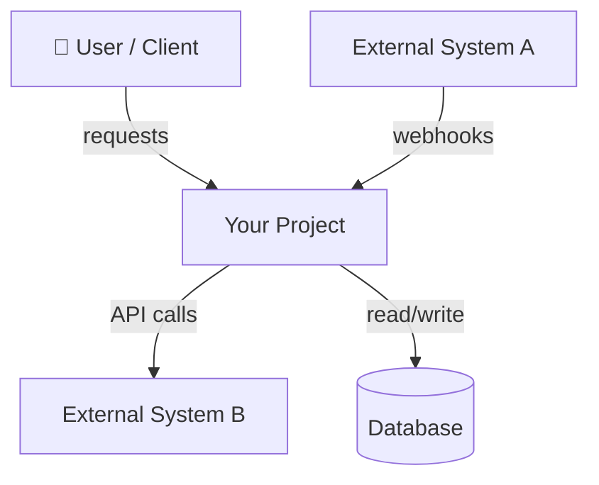

# /initialize — Initialize Project Overview

You are performing a project initialization scan. Your goal: produce a concise, high-level project overview so any AI agent can quickly understand this project's big picture. This is a **shallow, wide** scan — what the project IS and what it DOES, not how each piece works internally.

**Output:** `.workflow/project-overview.md` (max ~4k tokens, loaded on every session via CLAUDE.md)

## Step 1: Discovery

Perform ALL of the following scans. This process is **language-agnostic** — adapt your investigation based on what you find, don't assume any specific framework.

### 1a. Detect Project Type
- Scan for manifest files: `package.json`, `composer.json`, `Gemfile`, `requirements.txt`, `pyproject.toml`, `Cargo.toml`, `go.mod`, `pom.xml`, `build.gradle`, `CMakeLists.txt`, `*.csproj`, etc.
- If multiple manifests: identify primary vs supporting (e.g., monorepo with multiple packages)
- If none found: scan file extensions to infer language(s)

### 1b. Scan Project Structure
- List top-level directories
- Identify common patterns: `src/`, `lib/`, `app/`, `pkg/`, `internal/`, `cmd/`, `tests/`, `docs/`, `config/`, `scripts/`, `migrations/`, etc.
- Note: project structure conventions vary by ecosystem — don't assume

### 1c. Read Existing Documentation
- Read `README.md`, `CONTRIBUTING.md`, any `docs/` directory (skim, don't deep-dive)
- Read any architecture decision records (ADRs) if present
- Skip `CLAUDE.md` (that's ours)

### 1d. Read Configuration Files
- Build/compile config: tsconfig, webpack, vite, Makefile, Dockerfile, etc.
- Linting/formatting: eslint, prettier, rubocop, flake8, etc.
- CI/CD: `.github/workflows/`, `.gitlab-ci.yml`, `Jenkinsfile`, etc.
- Infrastructure: `docker-compose.yml`, terraform, k8s manifests, etc.

### 1e. Read Entry Points
Identify main entry file(s) by ecosystem convention:
- JS/TS: `index.ts`, `main.ts`, `app.ts`, `server.ts`
- Python: `main.py`, `app.py`, `__main__.py`, `manage.py`, `wsgi.py`
- Go: `main.go`, `cmd/*/main.go`
- Rust: `main.rs`, `lib.rs`
- Java/Kotlin: `*Application.java`, `*Application.kt`
- C#: `Program.cs`, `Startup.cs`
- Other: look for main/entry pattern in manifest

Read 2-3 representative source files to understand coding style.

### 1f. Read Routing/API Surface (if applicable)
- Web: route definitions, controller files, API specs (OpenAPI, etc.)
- CLI: command definitions, argument parsers
- Library: public exports, module index

### 1g. Read Database Schema (if applicable)
- Migration files, schema definitions, ORM models
- Identify main entities and their relationships (high-level — main tables, not every column)
- Note the database type (relational, document, graph, etc.)

### 1h. Identify Core User Flows
- From routes, controllers, and entry points: identify the 3-5 most important things the system does
- Trace each flow at a high level: what triggers it, what steps happen, what's the output
- Note side effects (sends email, charges payment, writes audit log, publishes event)
- Do NOT trace failure/recovery details — that's `/analyze` depth

### 1i. Detect Design Patterns & Conventions

The point: future agents need to know what patterns this project uses *consistently* so new code matches the existing style. Capture **named patterns with file evidence** — not vague descriptions.

Sample 5–10 representative source files across different module types (one controller, one service, one model/entity, one utility, one test, one composition root or DI module if present). Look for these named patterns and note WHERE you found them:

**Object construction & lifecycle:**
- Singleton (single shared instance — `getInstance()`, module-level const, `@Injectable({ scope: SINGLETON })`)
- Factory / Factory Method (creation hidden behind a function or class)
- Builder (fluent step-by-step construction)
- Dependency Injection (constructor injection, container, decorators like `@Inject`)
- Service Locator (global registry lookup)

**Composition & structure:**
- Composition over Inheritance (small components combined — React composition, mixin patterns, trait composition)
- Decorator (wrapping behavior — Python decorators, TS class decorators, middleware chains)
- Module pattern (encapsulated namespaces with explicit exports)
- Hexagonal / Ports & Adapters (domain core + adapter ring)
- Repository + Unit of Work (data-access abstractions)
- Service Layer (orchestration above domain models)

**Behavior & flow:**
- Strategy (interchangeable algorithm implementations)
- Observer / Pub-Sub / EventEmitter
- Mediator / Command Bus / Message Bus (CQRS)
- Middleware / Pipeline / Chain of Responsibility
- State Machine (XState, statecharts, explicit FSM)

**Data & error handling:**
- Result/Either type (vs throwing exceptions)
- Optional/Maybe (vs null)
- Immutable updates (vs in-place mutation)
- Validation at boundary (Zod, Joi, FluentValidation, JSON-schema)

**Project-specific conventions** (detect by sampling multiple files of the same kind):
- Naming: `*Controller`, `*Service`, `*Repository`, `*Handler`, `*UseCase`, `*Command`, `use{X}` hooks
- File organization: feature-folder vs layer-folder, co-located vs separated tests
- Error handling: throw-vs-return, custom error classes, error translation at boundary
- Logging: structured vs string, correlation IDs, log levels in use
- Async style: callbacks / promises / async-await / channels / signals

For each pattern actually present, record: **pattern name** + **representative file path** + **one-line note on how it's used here**. Skip patterns the project doesn't use — do not invent.

### 1j. Identify Project Intention & Priorities

The point: future agents must know what trade-offs to make when the answer isn't obvious from the code. A fintech project picks consistency over speed; a startup MVP picks speed over polish; a medical device picks safety over flexibility. This section is what tells the next agent which way to lean.

**Gather clues from code & docs first:**
- README's stated purpose / business context
- Domain language in code (`Account`, `Transaction`, `Ledger` → finance; `Patient`, `Diagnosis` → health; `Tenant`, `Workspace` → B2B SaaS)
- Regulated-industry signals: audit logging everywhere, immutable event store, double-entry accounting, PHI/PII handling code, GDPR/HIPAA/PCI markers
- Iteration-speed signals: heavy feature-flag usage, A/B testing infra, "experiment" directories
- Safety/correctness signals: extensive test coverage, property-based tests, formal types, schema validation at every boundary
- License + branding clues for company vs open-source vs internal tool

**Then ASK THE USER explicitly** — do not guess. Pose this as a single batched question:

> "Before I write the overview, I want to capture this project's intention and priorities — these guide every future trade-off. Based on the code I'd guess **{detected domain class}** with priorities like **{your top-3 guess from clues}**. Could you confirm or correct:
> 1. **Domain class** — is this {fintech / healthtech / edtech / B2B SaaS / consumer / internal tool / library / other}?
> 2. **Top 3 priorities, ranked** — pick from: consistency, auditability, correctness, security, performance, scalability, developer velocity, time-to-market, user experience, accessibility, cost, simplicity. Rank order matters — what wins when two conflict?
> 3. **Explicit trade-offs already made** — anything like 'we chose X over Y because Z' that should be load-bearing for future decisions?
> 4. **Hard rules derived from these priorities** — e.g., 'all money math uses Decimal, never float', 'every state change writes an audit log', 'no breaking API changes without 3-month deprecation'."

Wait for the answer. If the user skips the question, fall back to the inferred values but mark them as "(inferred — unconfirmed)" in the output.

## Step 2: Analysis

From everything discovered, identify:
- Language(s), frameworks, key libraries/dependencies
- Architectural pattern (monolith, microservices, modular monolith, hexagonal, MVC, CQRS, event-driven, serverless, etc.)
- Project topology (single app, monorepo, library, CLI tool, API service)
- How modules/domains are organized and their responsibilities
- **Core user flows** — the 3-5 most important things the system does, traced at a high level
- **Main data model** — key entities and their relationships (not every column, just the shape)
- **System context** — what's outside this system (users, external services, inputs, outputs)
- Data flow — how data enters, transforms, and exits the system
- External integrations (databases, APIs, message queues, caches)
- Authentication / authorization pattern (if applicable)
- Testing setup (framework, test location convention, how to run)
- Build / deploy pipeline
- Coding conventions (naming, file structure, import patterns, error handling)
- **Named design patterns in use** (from 1i) — only those actually present, with file evidence
- **Project intention & priorities** (from 1j) — domain class, ranked priorities, explicit trade-offs, hard rules

## Step 3: Write `project-overview.md`

Write the output to `.workflow/project-overview.md` using the format below.

**Rules:**
- Max ~4k tokens. Every token earns its place — concise and complete.
- **Diagrams are MANDATORY** — system context, architecture, data flow, and ER diagrams. Use Mermaid syntax.
- Use tables for structured data — maximum information density per token.
- **Adaptive sections** — omit sections that don't apply (no "Routing Strategy" for a CLI tool, no "Core Flows" for a utility library).
- A simple CLI tool might need 800 tokens. A complex service might need 3.5k. Don't pad.

### Output Format

```markdown
---
project: {name}
type: {web-app | api-service | cli-tool | library | monorepo | mobile-app}
last_updated: {YYYY-MM-DD}
languages: [{languages}]
frameworks: [{frameworks}]
---

## What This Project Does
{2-3 sentences — what problem it solves, who uses it, key use cases}

## Project Intention & Priorities

**This block governs trade-off decisions. When two paths conflict, the higher-ranked priority wins.**

- **Domain class:** {fintech | healthtech | edtech | B2B SaaS | consumer app | internal tool | library | other}
- **Priorities (ranked, highest first):**
  1. {priority} — {one-line why this is #1 for this project}
  2. {priority} — {why}
  3. {priority} — {why}
- **Explicit trade-offs already made:**
  - {We chose X over Y because Z}
  - {We accept cost A in exchange for benefit B}
- **Hard rules derived from these priorities** (binding for all new code):
  - {e.g., "All money math uses Decimal, never float"}
  - {e.g., "Every state change writes an audit log entry"}
  - {e.g., "No breaking API changes without 3-month deprecation"}

{If any field is "(inferred — unconfirmed)", the user did not confirm and these should be re-checked.}

## Tech Stack & Key Dependencies
| Category | Technology | Purpose |
|----------|-----------|---------|
| Language | ... | ... |
| Framework | ... | ... |
| Database | ... | ... |

## System Context
{Where this project sits in the larger environment}



## System Architecture
{Internal pattern name + brief explanation}


## Project Structure
{Key directories with one-line descriptions — NOT exhaustive, only meaningful directories}

## Modules / Domains
| Module | Location | Responsibility |
|--------|----------|---------------|
| ... | ... | ... |

## Core Flows
{3-5 most important things the system does. Keep each flow to 3-5 lines.
 Do NOT include failure cases or recovery — that's /analyze depth.}

### {Flow 1 Name} (e.g., User Login)
- **Trigger:** {what kicks it off — user action, API call, scheduled job, webhook}
- **Steps:** {high-level sequence, 3-5 steps}
- **Input / Output:** {what goes in, what comes out}
- **Side Effects:** {emails sent, payments charged, events published, logs written}

### {Flow 2 Name} (e.g., Create Order)
- **Trigger:** ...
- **Steps:** ...
- **Input / Output:** ...
- **Side Effects:** ...

## Data Model
{Main entities and their relationships — high-level shape, not every column}

| Entity | Key Fields | Relationships |
|--------|-----------|---------------|
| User | id, email, role | has many Orders, has one Profile |
| Order | id, status, total | belongs to User, has many LineItems |
| ... | ... | ... |

```mermaid
erDiagram
    USER ||--o{ ORDER : places
    ORDER ||--|{ LINE_ITEM : contains
    ORDER }|--|| PAYMENT : "paid via"
    ...
```

## Data Flow
{How data enters, transforms, and exits the system}

```mermaid
sequenceDiagram
    ...
```

## External Integrations
| System | Type | Purpose |
|--------|------|---------|
| ... | ... | ... |

## Design Patterns In Use

**Only patterns actually present in the codebase, with file evidence. Future code in this project should follow these same patterns for consistency.**

| Pattern | Where used (file or module) | How it's used here |
|---------|----------------------------|-------------------|
| {e.g., Singleton} | {e.g., `src/db/connection.ts`} | {e.g., Single shared `PrismaClient` instance via module-level const} |
| {e.g., Repository} | {e.g., `src/users/user.repository.ts`} | {e.g., Each aggregate has a Repository class; queries never built in services} |
| {e.g., Composition over Inheritance} | {e.g., `src/components/`} | {e.g., React components compose smaller components; no class inheritance} |
| {e.g., Middleware Pipeline} | {e.g., `src/api/middleware/`} | {e.g., Express-style chain; auth → validation → handler → logging} |
| {e.g., Result type} | {e.g., `src/shared/result.ts`} | {e.g., Domain operations return `Result<T, DomainError>`; exceptions only at infrastructure boundaries} |

## Conventions

| Area | Convention |
|------|-----------|
| Naming | {e.g., `*Service` for orchestration, `*Repository` for data access, `use*` for hooks} |
| File organization | {e.g., feature-folder under `src/features/{name}/`, tests co-located as `*.test.ts`} |
| Error handling | {e.g., Result type in domain, throw at HTTP boundary, custom error classes per domain} |
| Logging | {e.g., Structured JSON via pino, correlation ID per request, no `console.log`} |
| Async style | {e.g., async/await throughout, no callbacks, no raw promises in business logic} |
| Validation | {e.g., Zod schemas at every API boundary, parse-don't-validate} |

## Anti-Patterns Explicitly Avoided

{Patterns the project has decided NOT to use — derived from priorities and trade-offs above. Future agents must not re-introduce these.}

- {e.g., No static state outside designated Singletons}
- {e.g., No business logic in controllers / route handlers}
- {e.g., No floats for money; no Date math without timezone-aware library}

## Testing
{Framework, location convention, how to run, coverage tool}

## Build & Deploy
{Build command, deploy target, CI/CD pipeline summary}
```

## Step 4: User Review

After writing the file, present a summary to the user:
1. Show the key findings: project type, stack, architecture pattern, core flows, **priority ranking, and detected design patterns**.
2. Specifically surface for confirmation (these govern future decisions and must be right):
   - The **ranked priorities** and any **hard rules** captured
   - The **design patterns** detected, with their file evidence — ask "any pattern listed here that isn't actually a project convention, or any convention I missed?"
   - The **anti-patterns explicitly avoided** — ask "anything else the project has decided NOT to do?"
3. Ask: "Is there anything this overview is missing or got wrong? You can also edit `.workflow/project-overview.md` directly."
4. If the user provides corrections, update the file accordingly.

## Constraints
- Do NOT deep-analyze individual components (that's `/analyze`'s job)
- Do NOT read every file — sample representative files, scan structure
- Do NOT include code snippets in the output — this is an overview, not a code tour
- Do NOT generate sections that don't apply to this project type
- Do NOT include failure cases or recovery behavior in Core Flows — that's `/analyze` depth
- Do NOT list every database column in Data Model — just main entities, key fields, and relationships
- Do NOT exceed ~4k tokens in the output file
- Do NOT list a design pattern (Singleton, Factory, Repository, etc.) unless you found a concrete file that uses it. Inventing patterns the project doesn't actually use causes future agents to write code against false conventions.
- Do NOT guess project priorities silently — always ask the user (Step 1j). If the user does not answer, mark inferred values as "(inferred — unconfirmed)" so future agents know to verify before relying on them.
