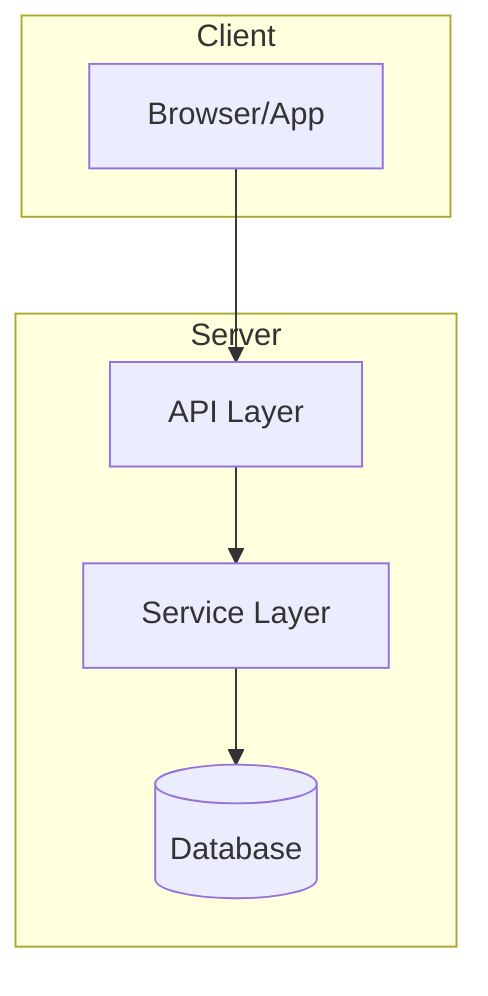
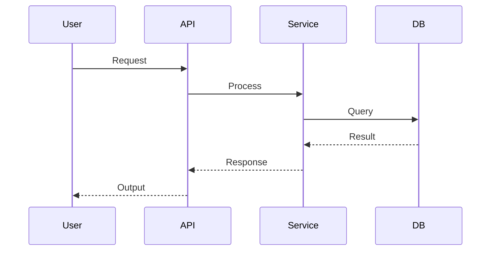

# AI Coding Workflow — Implementation Plan

## Executive Summary

A Claude Code workflow framework with 4 core functions: **Planning**, **Execute Plan**, **Init Project**, and **Component Analyze**. Built on an orchestrator + subagent architecture where the main session stays lean and dispatches focused agents for each task. Every decision optimizes for **prompt quality**, **context efficiency**, and **codebase knowledge maintenance**.

### Architecture Decision: Hybrid Storage

```
.claude/                          ← Claude Code native (auto-discovered)
├── skills/                       ← Skill definitions (slash commands)
│   ├── plan/SKILL.md
│   ├── execute/SKILL.md
│   ├── init/SKILL.md
│   ├── analyze/SKILL.md
│   ├── review/SKILL.md
│   └── jira/
│       ├── SKILL.md              ← Jira ticket fetch + transform
│       └── jira_fetch.py         ← Python script (ADF → markdown)
├── agents/                       ← Agent definitions
│   ├── planner.md
│   ├── reviewer.md
│   ├── executor.md
│   ├── analyzer.md
│   └── doc-updater.md
├── rules/                        ← Passive context (always loaded)
│   ├── quality-criteria.md       ← General quality rules
│   ├── tdd-policy.md             ← TDD enforcement rules
│   └── security-gates.md         ← Blocked commands/patterns
├── hooks/                        ← Lifecycle hooks
│   ├── pre_tool_use.py           ← Security blocking
│   ├── post_tool_use.py          ← Quality checks on writes
│   └── context_monitor.py        ← Context usage warnings
└── settings.json                 ← Hook registration, permissions

.workflow/                        ← Framework runtime data (your data)
├── project-overview.md           ← Init output (always loaded via CLAUDE.md)
├── plans/                        ← Planning output
│   └── {YYMMDD}-{name}/
│       ├── plan.md               ← Master plan
│       ├── phase-01-{slug}.md    ← Phase definitions
│       ├── phase-02-{slug}.md
│       └── state.md              ← Execution state
├── rules/                        ← Project-specific quality rules (markdown)
│   ├── planning/                 ← Rules for plan review
│   │   └── {rule-name}.md
│   └── code/                     ← Rules for code review
│       └── {rule-name}.md
└── config.json                   ← Project config (references rules dirs, models, etc.)

Component analysis docs (co-located):
  src/components/reports/Dashboard.analysis.md   ← lives next to Dashboard.tsx
  src/services/authService.analysis.md           ← lives next to authService.ts
  src/modules/auth/auth.analysis.md              ← module-level doc at module root
```

**Why hybrid:**
- `.claude/` — Claude Code auto-discovers skills, agents, rules, hooks. Fighting this creates friction.
- `.workflow/` — Your runtime state, plans, component docs. Separate from Claude's config. Can be committed to git or gitignored per preference.
- `CLAUDE.md` at project root ties them together — references `.workflow/project-overview.md` so Claude always has project context.

---

## Design Principles

1. **Prompt is king** — Every agent gets a precisely crafted prompt with exactly the context it needs. No more, no less.
2. **One agent, one goal** — Each subagent does exactly one thing. Multiple goals = blurry results.
3. **Context as fuel** — The deeper an agent understands the project/component, the better its output. Codebase knowledge is the competitive advantage.
4. **Pragmatic TDD** — Tests first by default. Documented exceptions for UI-heavy work, prototypes, and trivial config.
5. **State survives sessions** — Everything needed to resume is in files, not in context windows.
6. **Cost-aware** — Cheap models for routine tasks, expensive models for genuine ambiguity.

---

## Function 1: Init Project (`/init`)

### Purpose
Capture a high-level project overview so any AI agent can quickly understand the project's big picture. This is the **shallow, wide** scan — what the project IS, not how each piece works internally.

### When to Run
- First time using the workflow on an existing project
- When project undergoes major structural changes (new module, framework migration)
- User invokes `/init` manually

### Output
`.workflow/project-overview.md` — loaded via CLAUDE.md reference on every session.

### Process

This process is **language-agnostic**. The skill provides a general discovery strategy, not a hardcoded checklist for any specific framework. The agent adapts its investigation based on what it finds.

```
Step 1: Discovery (automated — language-agnostic)
├── Detect project type by scanning for manifest files:
│   ├── package.json, composer.json, Gemfile, requirements.txt, pyproject.toml,
│   │   Cargo.toml, go.mod, pom.xml, build.gradle, CMakeLists.txt, *.csproj, etc.
│   ├── If multiple manifests: identify primary vs supporting (e.g., monorepo)
│   └── If none: scan file extensions to infer language(s)
│
├── Scan project structure:
│   ├── List top-level directories with `ls`
│   ├── Identify common patterns: src/, lib/, app/, pkg/, internal/, cmd/,
│   │   tests/, docs/, config/, scripts/, migrations/, etc.
│   └── Note: project structure conventions vary by ecosystem — don't assume
│
├── Read existing documentation:
│   ├── README.md, CLAUDE.md, CONTRIBUTING.md, docs/ directory
│   └── Any architecture decision records (ADRs) if present
│
├── Read configuration files:
│   ├── Build/compile config (tsconfig, webpack, vite, Makefile, Dockerfile, etc.)
│   ├── Linting/formatting config (eslint, prettier, rubocop, flake8, etc.)
│   ├── CI/CD config (.github/workflows, .gitlab-ci.yml, Jenkinsfile, etc.)
│   └── Infrastructure config (docker-compose, terraform, k8s manifests, etc.)
│
├── Read entry points:
│   ├── Identify main entry file(s) by ecosystem convention:
│   │   ├── JS/TS: index.ts, main.ts, app.ts, server.ts
│   │   ├── Python: main.py, app.py, __main__.py, manage.py, wsgi.py
│   │   ├── Go: main.go, cmd/*/main.go
│   │   ├── Rust: main.rs, lib.rs
│   │   ├── Java/Kotlin: *Application.java, *Application.kt
│   │   ├── C#: Program.cs, Startup.cs
│   │   └── Other: look for main/entry pattern in manifest
│   └── Read 2-3 representative source files to understand coding style
│
└── Read routing/API surface (if applicable):
    ├── Web: route definitions, controller files, API specs (OpenAPI, etc.)
    ├── CLI: command definitions, argument parsers
    └── Library: public exports, module index

Step 2: Analysis (analyzer agent — model: sonnet)
├── Identify: language(s), frameworks, key libraries/dependencies
├── Identify: architectural pattern (monolith, microservices, modular monolith,
│   hexagonal, MVC, CQRS, event-driven, serverless, etc.)
├── Identify: project topology (single app, monorepo, library, CLI tool, API service)
├── Identify: how modules/domains are organized and their responsibilities
├── Identify: data flow — how data enters, transforms, and exits the system
├── Identify: external integrations (databases, APIs, message queues, caches)
├── Identify: authentication / authorization pattern (if applicable)
├── Identify: testing setup (framework, test location convention, how to run)
├── Identify: build / deploy pipeline
├── Identify: coding conventions (naming, file structure, import patterns, error handling)
└── Produce: system diagrams (Mermaid) showing how major components connect

Step 3: Document Generation
├── Write .workflow/project-overview.md (format below)
└── Update CLAUDE.md to reference .workflow/project-overview.md

Step 4: User Review
├── Present summary to user
├── Ask user to correct/add anything the scan missed
└── User can edit the file directly — it's their document too
```

### Output Format: `project-overview.md`

The output adapts to what exists in the project. Sections that don't apply are omitted (e.g., no "Routing Strategy" for a CLI tool, no "UI Layer" for a backend service). Diagrams are mandatory — they communicate structure faster than prose for both humans and AI.

```markdown
---
project: {name}
type: {web-app | api-service | cli-tool | library | monorepo | mobile-app}
last_updated: {date}
languages: [TypeScript, Python]
frameworks: [Next.js, FastAPI]
---

## What This Project Does
{2-3 sentences — what problem it solves, who uses it}

## Tech Stack & Key Dependencies
| Category | Technology | Purpose |
|----------|-----------|---------|
| Language | TypeScript 5.x | Primary language |
| Framework | Next.js 15 | App router, server components |
| Database | PostgreSQL via Supabase | Auth, storage, realtime |
| ... | ... | ... |

## System Architecture
{Pattern name + explanation — adapt to project type}



## Project Structure
{Key directories with one-line descriptions — NOT exhaustive, only meaningful directories}

## Modules / Domains
| Module | Location | Responsibility |
|--------|----------|---------------|
| Auth | src/modules/auth/ | Login, signup, session management |
| Reports | src/modules/reports/ | Revenue dashboards, data export |

## Data Flow
{How data enters, transforms, and exits — adapt to project type}
{Include diagram:}



## External Integrations
| System | Type | Purpose |
|--------|------|---------|
| Stripe | Payment API | Subscription billing |
| Redis | Cache | Session + query cache |

## Key Patterns & Conventions
{Naming conventions, file organization, error handling, logging patterns}

## Testing
{Framework, location convention, how to run, coverage tool}

## Build & Deploy
{Build command, deploy target, CI/CD pipeline summary}
```

**Token budget:** Aim for concise and complete. Max **4k tokens**. Not every project needs 4k — a simple CLI tool might need 800, a complex microservice architecture might need 3.5k. The rule is: every token earns its place, but never sacrifice clarity to hit an arbitrary limit. 4k / 200k = 2% of agent context — an acceptable cost to prevent every downstream agent from making architectural mistakes.

**Diagrams are key:** System architecture diagram + data flow diagram are REQUIRED. They communicate structure more efficiently than prose — valuable for both human readers and AI agents. Users can also edit/extend these diagrams.

### Design Decisions

| Decision | Rationale | Alternative Considered |
|----------|-----------|----------------------|
| Language-agnostic discovery | The skill works on any project by detecting ecosystem from manifest files, not assuming a specific stack. Instructions are general strategies, not framework-specific checklists. | Hardcoded steps per framework (doesn't scale, breaks on unfamiliar stacks) |
| Mandatory diagrams | Mermaid diagrams communicate architecture and data flow faster than prose — for both humans and AI. Users can also edit them in any markdown editor. | Prose-only (less efficient per token, harder to scan visually) |
| Adaptive output sections | A CLI tool doesn't need "Routing Strategy", a library doesn't need "Deploy Target". Irrelevant sections waste tokens and confuse agents. | Fixed template (forces irrelevant sections, wastes always-loaded context) |
| Shallow scan, not deep analysis | Init is for orientation. Deep analysis is Component Analyze's job. Keeps the overview token-light. | Full recursive scan (too expensive, too verbose for always-loaded context) |
| Single file output | One file to reference in CLAUDE.md. No fragmentation. | Multiple files per section (unnecessary complexity for this depth) |
| Table format for structured data | Maximum information density per token. Tables compress better than prose. | Prose paragraphs (wastes tokens, harder to scan) |
| User can read and edit | This is a shared document — AI generates it, humans refine it. Not a black-box output. | AI-only document (misses human knowledge that code can't reveal) |

---

## Function 2: Planning (`/plan`)

### Purpose
Transform requirements into a detailed, dependency-aware, quality-checked execution plan divided into phases and tasks.

### When to Run
- User has a feature/task to implement
- User invokes `/plan` with requirements (text, file path, git issue, or Jira ticket)

### Input Sources

| Source | Invocation | How It Works |
|--------|-----------|-------------|
| **User text** | `/plan "Add user export feature"` | Direct text parsed as requirements |
| **Markdown file** | `/plan ./requirements/export.md` | Read file, extract requirements |
| **Git issue** | `/plan gh:123` or `/plan https://github.com/org/repo/issues/123` | Fetch via `gh issue view`, extract body + comments |
| **Jira ticket** | `/plan jira:PROJ-456` | Invoke `/jira` skill to fetch + transform (see below) |

### Jira Integration (`/jira` skill)

Jira content is HTML-heavy, uses Atlassian Document Format (ADF), and includes metadata noise that wastes tokens. A Python script transforms it into clean, AI-friendly markdown.

```
Invocation: /jira PROJ-456
                │
                ▼
┌─────────────────────────────────────┐
│  Python script: jira_fetch.py       │
│  ├── Call Jira REST API v3          │
│  │   GET /rest/api/3/issue/PROJ-456 │
│  │   (auth via JIRA_TOKEN env var)  │
│  │                                  │
│  ├── Extract & transform:           │
│  │   ├── Title → # heading          │
│  │   ├── Description (ADF → MD)     │
│  │   ├── Acceptance criteria        │
│  │   ├── Subtasks (if any)          │
│  │   ├── Linked issues (blockers,   │
│  │   │   related, duplicates)       │
│  │   ├── Attachments (list URLs)    │
│  │   └── Comments (last 5, newest   │
│  │       first — older ones are     │
│  │       usually noise)             │
│  │                                  │
│  ├── Strip:                         │
│  │   ├── Jira metadata noise        │
│  │   │   (reporter, watchers,       │
│  │   │   workflow transitions)      │
│  │   ├── HTML tags → markdown       │
│  │   ├── ADF nodes → markdown       │
│  │   └── Empty/boilerplate sections │
│  │                                  │
│  └── Output: clean markdown to stdout│
└─────────────────────────────────────┘
                │
                ▼
        Orchestrator receives
        clean markdown requirements
```

**Why a Python script, not direct API call from Claude:**
- Jira API returns deeply nested JSON (ADF format) — 10-50x larger than the useful content
- Parsing ADF in-context wastes tokens on structure navigation
- A script does the heavy lifting once, outputs clean markdown
- Script is reusable across skills (planning, status checks, etc.)

**Configuration:** `.workflow/config.json` includes Jira settings:
```json
{
  "jira": {
    "base_url": "https://yourorg.atlassian.net",
    "auth_env_var": "JIRA_TOKEN",
    "default_project": "PROJ"
  }
}
```

### Process

```
Phase A: Requirement Gathering
├── Step 1: Input Ingestion
│   ├── Accept: user text, markdown file, git issue URL, or Jira ticket ID
│   ├── If git issue: fetch via `gh issue view` and extract body
│   ├── If Jira ticket: invoke /jira skill (Python script → clean markdown)
│   └── Parse into structured requirements list
│
├── Step 2: Clarification (orchestrator — model: sonnet)
│   ├── Analyze requirements for gaps, ambiguities, assumptions
│   ├── Cross-reference with .workflow/project-overview.md (does this fit the architecture?)
│   ├── Check affected components — load their .workflow/components/{name}.md if they exist
│   ├── Generate clarification questions (specific, not open-ended)
│   ├── Present to user, wait for answers
│   └── Loop until no more questions (max 3 rounds)

Phase B: Component Intelligence Gathering (NEW — before plan creation)
├── Step 2.5: Analyze Affected Components
│   ├── From requirements + project-overview, identify components that will be:
│   │   ├── Modified (existing components that need changes)
│   │   ├── Extended (components that need new features added)
│   │   ├── Consumed (components whose API the new code will use)
│   │   └── Created (new components — check similar existing ones for patterns)
│   │
│   ├── For each affected component:
│   │   ├── If .workflow/components/{name}.md exists AND is current → load it
│   │   ├── If .workflow/components/{name}.md exists BUT stale → trigger /analyze (update mode)
│   │   └── If .workflow/components/{name}.md does NOT exist → trigger /analyze (full mode)
│   │
│   ├── Why this step exists:
│   │   Planning without component knowledge = planning on assumptions.
│   │   Example: planner assumes a component supports feature X (based on its name),
│   │   but the component doc reveals it doesn't, or it has a hidden constraint that
│   │   makes the approach unworkable. Discovering this at EXECUTION time means:
│   │   - Wasted execution effort on a flawed plan
│   │   - Expensive re-planning mid-execution
│   │   - State file complexity (rolling back partially executed tasks)
│   │   Discovering it NOW (before planning) means the planner makes informed decisions.
│   │
│   ├── Cost trade-off:
│   │   ├── Cost: Running /analyze before planning adds time + tokens
│   │   ├── Benefit: Avoids expensive mid-execution replanning
│   │   ├── Net: Positive — one analyze costs less than one failed phase + replan
│   │   └── Optimization: only analyze components that DON'T already have current docs
│   │
│   └── Output: all affected components now have up-to-date .workflow/components/{name}.md
│       ready for the planner to consume

Phase C: Plan Creation
├── Step 3: Planning (planner agent — model: opus)
│   ├── Context provided to agent:
│   │   ├── Finalized requirements
│   │   ├── .workflow/project-overview.md
│   │   ├── Relevant .workflow/components/{name}.md files (now guaranteed to exist + be current)
│   │   ├── Existing code (key files identified from requirements)
│   │   └── .workflow/config.json (project-specific criteria)
│   │
│   ├── Output: plan.md + phase files
│   ├── Plan structure:
│   │   ├── Summary (what we're building and why)
│   │   ├── Scope boundaries (what's IN and OUT)
│   │   ├── Component intelligence summary (key findings from analysis that affect the plan)
│   │   ├── Phase breakdown with dependency graph
│   │   ├── Parallel group assignments (which phases can run together)
│   │   └── Risk assessment (what could go wrong — informed by component hidden details)
│   │
│   └── Per-phase structure:
│       ├── Goal (what this phase achieves)
│       ├── Tasks (list with: description, files to modify, acceptance criteria)
│       ├── Test requirements (what tests to write, what to verify)
│       ├── Dependencies (which phases must complete first)
│       └── Affected components (for doc updates later)

Phase C: Plan Review
├── Step 4: Automated Review (reviewer agent — model: sonnet)
│   ├── Review dimensions (8 criteria):
│   │   1. Requirement coverage — every requirement maps to at least one task
│   │   2. Task atomicity — each task is one unit of work, completable in one agent session
│   │   3. Dependency correctness — no circular deps, correct sequencing
│   │   4. File scope — tasks don't modify same files in parallel phases
│   │   5. Acceptance criteria completeness — every task has verifiable criteria
│   │   6. Test coverage mapping — every behavior has a corresponding test requirement
│   │   7. Consistency — no conflicting instructions across phases
│   │   8. Codebase alignment — plan respects existing patterns from project-overview + component docs
│   │
│   ├── Output: review report with PASS/FAIL per dimension + specific findings
│   └── If FAIL: return to planner agent with findings (max 2 revision rounds)
│
├── Step 5: User Review
│   ├── Present final plan to user
│   ├── Show: phase summary, dependency graph, parallel groups, risk assessment
│   ├── User can: approve, request changes, or reject
│   └── If changes: update plan, re-run automated review (Step 4)

Phase D: Plan Finalization
├── Step 6: State Initialization
│   ├── Create .workflow/plans/{YYMMDD}-{name}/ directory
│   ├── Write plan.md, phase-NN-{slug}.md files
│   └── Write state.md (initial state: all tasks pending)
```

### Plan File Format: `plan.md`

```markdown
---
name: {feature-name}
created: {date}
status: draft | reviewed | approved | executing | completed
total_phases: {N}
total_tasks: {N}
---

## Summary
{What we're building and why — 2-3 sentences}

## Scope
### In Scope
- {requirement 1}
- {requirement 2}

### Out of Scope
- {explicitly excluded item}

## Component Intelligence
{Key findings from pre-planning component analysis that shaped this plan.
 Example: "ReportDashboard's date range is clamped to 90 days server-side,
 so the export feature must handle pagination for larger ranges."
 This section exists so reviewers understand WHY the plan makes certain choices.}

## Phase Overview
| # | Phase | Tasks | Dependencies | Group |
|---|-------|-------|-------------|-------|
| 1 | Database schema | 3 | none | A |
| 2 | API endpoints | 4 | Phase 1 | B |
| 3 | UI components | 5 | Phase 1 | B |
| 4 | Integration | 2 | Phase 2, 3 | C |

## Dependency Graph
{Mermaid diagram showing phase dependencies and parallel groups}

## Risk Assessment
| Risk | Impact | Mitigation |
|------|--------|-----------|
| {risk} | {high/med/low} | {mitigation strategy} |
```

### Phase File Format: `phase-NN-{slug}.md`

```markdown
---
phase: {number}
name: {phase-name}
status: pending | in_progress | review | completed
group: {A/B/C — parallel group}
depends_on: [phase numbers]
affected_components: [component names]
---

## Goal
{What this phase achieves — 1-2 sentences}

## Tasks
### Task 1: {task-name}
- **Description:** {what to do}
- **Files:** {files to create/modify}
- **Acceptance Criteria:**
  - {verifiable criterion 1}
  - {verifiable criterion 2}
- **Test Requirements:**
  - {test to write}

### Task 2: {task-name}
...

## Phase Completion Checklist
- [ ] All tasks completed
- [ ] All tests pass
- [ ] Code review passed
- [ ] Affected component docs updated
```

### Design Decisions

| Decision | Rationale | Alternative Considered |
|----------|-----------|----------------------|
| Component analysis BEFORE planning | Planning without component knowledge = planning on assumptions. If a component can't do what the planner assumes, we discover it at execution time — which means wasted work + expensive replanning. Analyzing first costs one agent call; failing mid-execution costs an entire phase + rollback. | Analyze during execution only (too late — plan is already committed to an approach) |
| Jira via Python script, not in-context API | Jira's ADF format is deeply nested JSON, 10-50x larger than the useful content. Parsing it in context wastes tokens. A script transforms once, outputs clean markdown. Reusable across skills. | Direct API call in context (token-expensive, error-prone ADF parsing) |
| Multiple input sources (text, file, git, Jira) | Requirements live in different systems across teams. Supporting all common sources removes friction. Each source has a normalizer that produces the same structured output. | Text-only input (forces users to copy-paste from other tools) |
| Opus for planning, Sonnet for review | Planning requires creative synthesis (Opus strength). Review is checklist-based (Sonnet sufficient). Cost optimization. | All Opus (expensive, unnecessary for review) |
| 8 review dimensions | Learned from gsd's 8D plan checker — covers the failure modes that matter. Each dimension catches a specific class of planning error. | Free-form review (misses systematic issues) |
| Max 2 revision rounds | Prevents infinite loops. If plan can't pass in 2 rounds, it needs human intervention, not more AI iterations. From claude-config's progressive de-escalation. | Unlimited revisions (risk: infinite loop, diminishing returns after round 2) |
| Medium detail per task | Task constrains WHAT and WHY, executor decides HOW. Prevents premature implementation in plan. Gives executor agent room to use its own expertise. | High detail with code (slow planning, brittle execution) |
| User review after automated review | User sees a clean plan (automated issues already fixed). Saves user time reviewing obvious problems. | User review before automated (user wastes time on things the reviewer would catch) |
| Parallel groups in plan | Explicit grouping makes execution deterministic. Executor doesn't need to compute parallelism at runtime. | Runtime dependency resolution (complex, error-prone) |
| File scope check (dimension 5) | Parallel phases modifying the same file = merge conflicts. This is the #1 cause of parallel execution failures. Learned from gsd's wave safety. | No file scope check (risk: merge conflicts in parallel execution) |

---

## Function 3: Execute Plan (`/execute`)

### Purpose
Execute an approved plan phase-by-phase, tracking state, enforcing TDD, running reviews, and maintaining codebase knowledge.

### When to Run
- After a plan is approved (`/plan` completed)
- User invokes `/execute` with plan path
- Or: `/execute --resume` to continue an interrupted session

### State File: `state.md`

```yaml
---
plan: {plan-name}
status: executing | paused | completed | failed
current_phase: 2
current_task: task-03
last_updated: 2026-03-21T14:30:00
started: 2026-03-21T10:00:00
---

## Execution Progress

### Phase 1: Database Schema [COMPLETED]
- [x] task-01: Create users table ✓
- [x] task-02: Create reports table ✓
- [x] task-03: Add RLS policies ✓
- Review: PASSED
- Docs updated: users-service, reports-service

### Phase 2: API Endpoints [IN PROGRESS]
- [x] task-01: GET /api/reports ✓
- [x] task-02: POST /api/reports ✓
- [>] task-03: PUT /api/reports/:id
  - ✓ Test written (PUT updates report)
  - ✓ Route handler created
  - ○ Validation middleware (next)
- [ ] task-04: DELETE /api/reports/:id

### Phase 3: UI Components [PENDING]
- [ ] task-01: ReportList component
- [ ] task-02: ReportForm component
- [ ] task-03: ReportChart component

## Session Log
- 2026-03-21T10:00 — Started execution
- 2026-03-21T12:15 — Phase 1 completed
- 2026-03-21T14:30 — Phase 2 task-03 in progress
```

**Why this format:**
- YAML frontmatter gives quick state extraction (`current_phase`, `current_task`, `status`)
- Markdown body gives human-readable progress (scannable in any editor)
- `[>]` marker for current task with sub-progress — enables precise resume
- Session log provides timeline without polluting task state

### Execution Flow

```
Step 1: Load Plan
├── Read plan.md + all phase files
├── Read state.md (if resuming)
├── Read .workflow/project-overview.md
├── Determine: which group to execute next (from dependency graph)
└── If resuming: find [>] task marker, continue from there

Step 2: For each phase group (sequential groups, parallel phases within group):
│
├── Step 2a: Phase Start
│   ├── Update state.md: phase status → IN PROGRESS
│   ├── Load relevant .workflow/components/{name}.md for affected components
│   │   └── These should already exist (created during planning Phase B)
│   │       If somehow missing → trigger Component Analyze as fallback
│   └── Prepare executor context
│
├── Step 2b: Task Execution (executor agent — model: sonnet)
│   ├── For each task in phase:
│   │   │
│   │   ├── TDD Step: Write Tests First
│   │   │   ├── Read acceptance criteria from phase file
│   │   │   ├── Write failing test(s) that verify the criteria
│   │   │   ├── Run tests — confirm they FAIL for expected reason
│   │   │   └── If TDD exception (UI/prototype): document reason in state.md
│   │   │
│   │   ├── Implementation Step
│   │   │   ├── Implement code to pass tests
│   │   │   ├── Run tests — confirm they PASS
│   │   │   └── Run type checker (if applicable)
│   │   │
│   │   ├── Update state.md
│   │   │   ├── Mark task [x] with ✓
│   │   │   └── Update sub-progress for current task
│   │   │
│   │   └── Commit (if configured)
│   │       └── Atomic commit: code + tests for this task
│   │
│   └── Agent context per task:
│       ├── Task description + acceptance criteria (from phase file)
│       ├── .workflow/project-overview.md (project context)
│       ├── Relevant .workflow/components/{name}.md (component knowledge)
│       ├── .workflow/config.json (project-specific quality criteria)
│       └── Source files being modified (read by agent)
│
├── Step 2c: Phase Review (reviewer agent — model: sonnet)
│   ├── Review criteria (3 layers):
│   │   │
│   │   ├── Layer 1: Plan Alignment
│   │   │   ├── All acceptance criteria met?
│   │   │   ├── No scope creep (no unplanned changes)?
│   │   │   └── Tests cover all specified requirements?
│   │   │
│   │   ├── Layer 2: General Quality (from .claude/rules/quality-criteria.md)
│   │   │   ├── Type safety (no `any`, proper types)
│   │   │   ├── Error handling (boundaries, not swallowed)
│   │   │   ├── Security basics (no hardcoded secrets, proper auth checks)
│   │   │   ├── No dead code, no commented-out code
│   │   │   ├── Naming clarity
│   │   │   └── Test quality (meaningful assertions, not just "doesn't throw")
│   │   │
│   │   └── Layer 3: Project-Specific (from .workflow/config.json)
│   │       └── Custom rules defined per project (e.g., "always use server actions for mutations")
│   │
│   ├── Output: review report (PASS / FAIL with specific findings)
│   ├── If FAIL: executor agent fixes issues (max 2 fix rounds)
│   └── Show review to user for approval
│
├── Step 2d: Playwright Check (conditional — frontend phases only)
│   ├── Trigger: if phase has `affected_components` with UI components
│   ├── Run: Playwright MCP to navigate affected pages
│   ├── Check: page loads, no console errors, visual correctness
│   └── Report to user
│
├── Step 2e: Documentation Update (doc-updater agent — model: sonnet)
│   ├── Step 2e.1: Assess Change Significance
│   │   ├── Read the git diff for this phase
│   │   ├── Classify each affected component's changes:
│   │   │   ├── NO UPDATE — trivial change (typo fix, dependency bump, log message)
│   │   │   │   → Skip doc update entirely. Cost: ~500 tokens (just the assessment).
│   │   │   ├── MINOR UPDATE — additive change (new field, new prop, new endpoint)
│   │   │   │   → Sonnet patches the existing .analysis.md inline
│   │   │   └── MAJOR UPDATE — structural change (data flow changed, component refactored,
│   │   │       │   API contract changed, new hidden behaviors introduced)
│   │   │       └── Trigger /analyze (update mode → Sonnet, or full mode → Opus if restructured)
│   │   └── Why Sonnet, not Haiku: this step requires JUDGMENT — assessing whether
│   │       a change is significant enough to affect downstream consumers. Haiku
│   │       can't reliably distinguish "added a column" from "changed the data flow."
│   │       Sonnet's judgment actually SAVES money: most changes are NO UPDATE or
│   │       MINOR, avoiding unnecessary full rewrites.
│   │
│   ├── Step 2e.2: Apply Updates
│   │   ├── For each component classified as MINOR: patch .analysis.md inline
│   │   ├── For each component classified as MAJOR: trigger /analyze
│   │   └── Update .workflow/project-overview.md only if architecture/modules changed
│   │
│   └── Step 2e.3: Commit documentation changes
│
└── Step 2f: Phase Completion
    ├── Update state.md: phase status → COMPLETED
    ├── Run regression: tests from prior completed phases still pass
    └── Proceed to next group

Step 3: Final Reconciliation (after all phases)
├── Reconciliation agent (model: sonnet)
├── Read all modified files across all phases
├── For each affected component:
│   ├── Run staleness check (last_commit vs current HEAD)
│   ├── If stale: assess significance (same NO/MINOR/MAJOR classification as Step 2e)
│   └── Apply targeted updates only where needed (not blind full rewrite)
├── Verify: project-overview.md still accurate (update if modules/architecture changed)
├── Verify: all tests pass (full suite)
├── Generate: execution summary report
└── Present to user
```

### Parallel Execution Model

```
Plan dependency graph:
  Phase 1 (group A) ──→ Phase 2 (group B) ──→ Phase 4 (group C)
                    ──→ Phase 3 (group B) ──↗

Execution:
  [Group A]  Phase 1 (sequential — no deps)
  [Group B]  Phase 2 ║ Phase 3 (parallel — both depend only on Phase 1)
  [Group C]  Phase 4 (sequential — depends on Phase 2 AND Phase 3)
```

**Parallel execution rules:**
- Phases in same group execute as separate subagents simultaneously
- File scope check (from planning) guarantees no conflicts
- Each parallel agent writes to its own state section (no state file contention)
- Group completion waits for all phases in group to finish
- Regression tests run after each group (not each phase in parallel)

### Resume Protocol

When a session is interrupted:

```
1. Read state.md frontmatter → get current_phase, current_task
2. Find [>] marker in body → get sub-progress
3. Determine resume point:
   ├── If mid-task: re-read task's sub-progress, continue from ○ marker
   ├── If between tasks: start next [ ] task
   └── If between phases: start next PENDING phase
4. Resume execution from that point
```

**Why this works:** All progress is in state.md (file-based, survives session death). Sub-progress bullets (`✓` done, `○` next) give precise resume points without re-executing completed work.

### Context Monitoring

Hook: `.claude/hooks/context_monitor.py`

```
Triggers: PostToolUse (every tool call)
Action:
  - Check context usage percentage
  - At ≤35% remaining: inject WARNING to orchestrator
  - At ≤25% remaining: inject CRITICAL — suggest completing current task then pausing
  - At ≤15% remaining: inject STOP — save state, pause execution
```

**Why:** Without this, agents silently degrade as context fills up. gsd implemented this and it prevents quality collapse in long sessions.

### Security Gates

Hook: `.claude/hooks/pre_tool_use.py`

```
Blocked patterns (always):
  - DROP DATABASE, TRUNCATE TABLE
  - git push --force (to main/master)
  - rm -rf /
  - curl | sh, wget | bash
  - Hardcoded secrets in code (API keys, passwords)

Ask-confirmation patterns:
  - git reset --hard
  - Destructive database migrations
  - File deletion outside project directory
  - npm install of new dependencies
```

**Why:** AI agents can and do execute dangerous commands. Blocking the catastrophic ones and gating the risky ones prevents irreversible damage. Learned from my-claude-setup's 3-tier security model.

### Design Decisions

| Decision | Rationale | Alternative Considered |
|----------|-----------|----------------------|
| Sonnet for execution, not Opus | Execution is mechanical (follow the plan). Sonnet is sufficient and 5x cheaper. Opus was used in planning where synthesis matters. | Opus everywhere (expensive, unnecessary for task-following) |
| Sonnet for doc updates (not Haiku) | Doc updates require JUDGMENT — classifying changes as no-update/minor/major. Haiku can't reliably distinguish "added a column" from "changed the data flow." Sonnet's judgment actually saves money: most changes are NO UPDATE or MINOR, avoiding unnecessary full rewrites. | Haiku (too dumb for significance assessment, risks bad docs or wasted rewrites) |
| State in markdown file, not TaskCreate | File survives session death, is human-readable, works across terminals. TaskCreate only survives within a session. | TaskCreate (doesn't persist across sessions) |
| Review after each phase, not each task | Task-level review is too granular (overhead > value). Phase-level catches integration issues. | Per-task review (too slow, too many reviews) |
| Regression tests after each group | Catches cross-phase breakage early. Running after each parallel phase would be redundant (they don't share files). | After each phase (redundant in parallel groups) or only at end (catches breakage too late) |
| Playwright only for UI phases | Running Playwright on backend-only phases wastes time. The phase file marks affected components — we know if UI is involved. | Always run Playwright (wasteful) |
| Max 2 fix rounds for review failures | Same principle as planning: if 2 rounds can't fix it, the issue needs human judgment. | Unlimited (risk: loop) |

---

## Function 4: Component Analyze (`/analyze`)

### Purpose
Deep analysis of a specific component — capture all hidden knowledge, business logic, trade-offs, and integration patterns. This is the **deep, narrow** scan that complements Init's shallow, wide overview.

### When to Run
- **User invokes** `/analyze {component-path}` manually
- **During planning** (Phase B): auto-triggered for affected components with missing/stale docs
- **During execution** (Step 2a fallback): if component doc is missing (should rarely happen — planning already did it)
- **During ad-hoc coding** (no plan): CLAUDE.md instructs "read component doc first, run `/analyze` if missing"
- **After execution** (Step 2e): update docs for components modified during the phase

### Staleness Detection (No Explicit Flags Needed)

The component doc's `last_commit` frontmatter field serves as a natural freshness indicator:

```
Any step that needs component knowledge:
  ├── Check: does {component}.analysis.md exist?
  │   ├── NO  → trigger /analyze (full mode)
  │   └── YES → compare last_commit vs `git log -1 --format=%H -- {entry_files}`
  │       ├── MATCH (doc is current) → load doc, skip analysis
  │       └── MISMATCH (code changed since analysis) → trigger /analyze (update mode)
```

This eliminates the need for explicit "already analyzed" flags in the plan. If planning analyzed a component and no code changed between planning and execution, the doc is current → execution skips it automatically. If code DID change, the doc is stale → execution re-analyzes. Always correct.

### Modes

| Mode | Trigger | Scope | Cost |
|------|---------|-------|------|
| **Full** | `/analyze {path}` or first-time analysis | Complete analysis from scratch | High (Opus) |
| **Recursive** | `/analyze {path} --recursive` | Component + all dependencies (leaf → top) | Very High |
| **Update** | Auto-triggered when doc exists but code changed since `last_commit` | Incremental — only re-analyze changed sections | Low (Sonnet) |

### Co-located Documentation

Component analysis docs live **alongside the component code**, not in a centralized directory:

```
src/components/reports/
├── Dashboard.tsx
├── Dashboard.test.tsx
├── Dashboard.analysis.md         ← analysis doc lives here
├── Filter.tsx
└── Filter.analysis.md

src/services/
├── authService.ts
└── authService.analysis.md

src/modules/auth/                  ← multi-file module
├── auth.analysis.md               ← doc at module root
├── authService.ts
├── authMiddleware.ts
└── authTypes.ts
```

**Why co-located instead of centralized `.workflow/components/`:**
- **No naming collisions** — path IS the namespace. `src/components/reports/Dashboard.analysis.md` and `src/components/admin/Dashboard.analysis.md` coexist naturally
- **Discoverable** — component + doc are adjacent in the file tree. Same pattern as `.test.tsx`, `.stories.tsx`
- **Git-friendly** — code change + doc update appear in the same directory in diffs
- **Easy to glob** — `**/*.analysis.md` finds all component docs across the project

**Naming rules:**
- Single-file component: `{FileName}.analysis.md` next to `{FileName}.{ext}`
- Multi-file module: `{module-name}.analysis.md` at the module root directory
- The `entry_files` field in frontmatter lists which source files are part of the component

### Process

```
Step 1: Discovery
├── Read entry file(s) at specified path
├── Identify component type (component, service, API route, hook, utility, module)
├── Map dependencies (imports, local and external)
├── Check: does {component}.analysis.md exist alongside the source?
│   ├── If yes + code unchanged (last_commit matches): load doc, done
│   ├── If yes + code changed: update mode — load existing doc, diff against current code
│   └── If no: full mode — proceed with full analysis

Step 2: Dependency Resolution (recursive mode only)
├── Build dependency tree from imports
├── Order: leaf → top (deepest dependencies first)
├── For each dependency (bottom-up):
│   ├── If {dep}.analysis.md exists and is current (staleness check): skip
│   └── If not: analyze dependency first (recursive call)
└── Ensures: when analyzing a component, all its dependencies are already documented

Step 3: Analysis (analyzer agent — model: opus for full, sonnet for update)
├── Context provided:
│   ├── Component source code (all files)
│   ├── Dependency analysis docs (from co-located {dep}.analysis.md files)
│   ├── .workflow/project-overview.md (architectural context)
│   └── Test files for this component
│
├── Analysis tasks:
│   1. Name & Type identification
│   2. Description (complete summary — what, what it does, use cases)
│   3. Dependencies (with purpose, key interface used)
│   4. Public API / Props / Outputs
│   5. Integration Patterns (how to USE this in real scenarios)
│   6. Architecture + Data Flow diagrams (Mermaid)
│   7. Patterns used (labeled, explained)
│   8. Hidden details & non-obvious behaviors
│   9. Test coverage assessment
│   └── 10. Document generation

Step 4: Output
├── Write {component}.analysis.md alongside the source file(s)
└── If component is a new major module: update .workflow/project-overview.md
```

### Output Format: `{ComponentName}.analysis.md`

Located alongside the source file. Example: `src/components/reports/Dashboard.analysis.md`

```markdown
---
name: ReportDashboard
type: react-component
summary: "Dashboard page that aggregates revenue data from multiple sources, renders interactive charts, and supports date-range filtering with server-side data fetching."
last_analyzed: 2026-03-21
last_commit: a1b2c3d
analysis_version: v1
dependencies: [ReportChart, ReportFilter, useReportData, reportService]
entry_files: [src/components/reports/ReportDashboard.tsx]
---

<!-- PART:CONTENT_START -->

## Purpose & Use Cases
{Complete description — not one sentence. All major features and usage scenarios.}

## Dependencies
| Dependency | Type | Purpose | Key Interface |
|-----------|------|---------|--------------|
| ReportChart | local component | Renders chart visualizations | `<ReportChart data={} type={} />` |
| useReportData | local hook | Fetches and caches report data | `{ data, loading, error, refetch }` |
| date-fns | external | Date formatting and range calc | `format(), subDays(), isWithinInterval()` |

## Public API / Props
| Prop | Type | Required | Default | Description |
|------|------|----------|---------|-------------|
| dateRange | DateRange | no | last30Days | Initial date range filter |
| onExport | (data) => void | no | undefined | Callback when user exports |

## Integration Patterns

### Basic Usage
```tsx
<ReportDashboard />
```

### With Custom Date Range
```tsx
<ReportDashboard dateRange={{ start: subDays(new Date(), 7), end: new Date() }} />
```

### With Export Handler
```tsx
<ReportDashboard onExport={(data) => downloadCSV(data)} />
```

## Architecture Diagram
```mermaid
graph TD
  RD[ReportDashboard] --> RF[ReportFilter]
  RD --> RC[ReportChart]
  RD --> URD[useReportData]
  URD --> RS[reportService]
  RS --> API[/api/reports]
```

## Data Flow
```mermaid
graph LR
  Props --> State[Internal State]
  State --> |dateRange| URD[useReportData]
  URD --> |fetch| API[/api/reports]
  API --> |response| URD
  URD --> |data| RC[ReportChart]
  RF[ReportFilter] --> |onChange| State
```

## Entrypoints & Files
| File | Role |
|------|------|
| src/components/reports/ReportDashboard.tsx | Main component |
| src/components/reports/ReportFilter.tsx | Filter subcomponent |
| src/hooks/useReportData.ts | Data fetching hook |

## Patterns Used
- **Container/Presentational** — Dashboard manages state, Chart/Filter are presentational
- **Custom Hook Extraction** — Data fetching logic extracted to useReportData
- **Controlled Filter** — Filter state lifted to Dashboard for cross-component coordination

## Hidden Details & Non-obvious Behaviors
| What | Why | Risk | Test Suggestion |
|------|-----|------|----------------|
| Report data is re-fetched on window focus | Business requirement: real-time dashboard | Med — can cause rate limiting on rapid tab switching | Mock visibilitychange event, verify fetch count |
| Date range clamped to max 90 days server-side | Database query performance — full-table scan above 90 days | Low — UI shows no error, just silently clamps | Request 120-day range, verify response covers only 90 days |
| Chart renders empty state for < 3 data points | UX decision — chart looks broken with 1-2 points | Low — but confusing if user expects partial chart | Filter to 1-day range with few records, verify empty state message |

<!-- PART:CONTENT_END -->

<!-- PART:EXTRA_START -->

## Tests
| Test File | Coverage |
|-----------|----------|
| __tests__/ReportDashboard.test.tsx | Rendering, filter interaction, data loading states |
| Missing: export functionality tests | ⚠️ No tests for onExport callback |

## Performance Notes
- useReportData uses SWR with 30s revalidation
- Chart uses canvas rendering (not SVG) for datasets > 1000 points

<!-- PART:EXTRA_END -->
```

### Progressive Loading Strategy

**Why:** Loading full component docs into every agent's context wastes tokens. Most of the time, an agent only needs to know WHAT a component does, not HOW it works internally.

```
Level 0: Frontmatter only (~50 tokens)
  → Used when: scanning dependencies, building project map
  → Extract: name, type, summary, dependencies list
  → How: Read {Component}.analysis.md with limit=10 (first 10 lines)

Level 1: Content part (~300-500 tokens)
  → Used when: implementing code that interacts with this component
  → Contains: API, integration patterns, architecture, hidden details

Level 2: Full document (~500-800 tokens)
  → Used when: modifying this component's internal code
  → Contains: everything including tests, performance, security notes
```

**How markers enable this:**
- `<!-- PART:CONTENT_START -->` / `<!-- PART:CONTENT_END -->` — Read tool can extract just this section
- `<!-- PART:EXTRA_START -->` / `<!-- PART:EXTRA_END -->` — Skip unless doing deep work on the component
- Frontmatter is always the first ~10 lines — cheapest to read

**How to find all component docs:** Glob for `**/*.analysis.md` from project root. Each doc's frontmatter contains `entry_files` pointing to the source it documents.

### Design Decisions

| Decision | Rationale | Alternative Considered |
|----------|-----------|----------------------|
| Opus for full analysis, Sonnet for updates | Full analysis requires deep reasoning about hidden behaviors, trade-offs, and patterns. Updates are incremental diffs. | Sonnet for all (misses nuance in full analysis) |
| Leaf → top dependency order | Understanding a component requires understanding what it depends on. Bottom-up ensures each analysis has full dependency context. From the user's conversation design. | Top → bottom (analyzes components without understanding their dependencies) |
| Co-located docs (`{Component}.analysis.md`) | Eliminates naming collisions (path IS the namespace). Same pattern as `.test.tsx` files. Git-friendly — code + doc changes in same directory. Discoverable via `**/*.analysis.md` glob. | Centralized `.workflow/components/` (naming collisions for duplicate component names, harder to find) |
| Single file per component | Reduces file count, easier maintenance, better token efficiency. From the user's conversation design. | Multiple files (metadata.yml + COMPONENT.md) — more complex, no benefit |
| YAML frontmatter in markdown | Standard format, parseable, human-readable. Same format used for plans and state. Consistency across the framework. | JSON sidecar files (extra file management, less readable) |
| Progressive loading with markers | Token optimization — load only what you need. Frontmatter for scanning, content for interaction, full for modification. | Always load full doc (wasteful for scanning/dependency checking) |
| `last_commit` as staleness flag | No explicit "already analyzed" flags needed. If code changed → doc is stale → re-analyze. If code unchanged → doc is current → skip. Works across planning, execution, and ad-hoc use. Always correct. | Explicit flags in plan/state (redundant, can be wrong if code changes between steps) |

---

## Quality Criteria System

### Layer 1: General Quality Rules (`.claude/rules/quality-criteria.md`)

Always loaded as passive context. Covers universal code quality:

```markdown
---
alwaysApply: true
---

## Code Quality Rules (Language-Agnostic)

### Type Safety & Correctness
- Use the strongest type system available in the language
- Avoid escape hatches (any in TS, Object in Java, interface{} in Go) — use proper types
- Function signatures should be self-documenting (clear parameter and return types)

### Error Handling
- Never swallow errors silently (no empty catch/except/rescue blocks)
- Errors should propagate with context (what operation failed + why)
- External API boundaries must handle failures gracefully

### Security
- No hardcoded secrets, API keys, or passwords in source code
- User input must be sanitized/validated at system boundaries
- Database queries must use parameterized queries / prepared statements
- Auth checks on every protected endpoint/route

### Testing
- Tests must have meaningful assertions (not just "doesn't throw/crash")
- Test file location should follow project convention
- Test names must describe behavior, not implementation details

### Code Hygiene
- No commented-out code (use version control history)
- No dead code (unused functions, unreachable branches)
- No debug output in production code (use proper logging)
- Consistent import/include ordering
```

### Layer 2: Project-Specific Rules (`.workflow/rules/`)

Markdown files organized by review purpose. Each file contains the rule, WHY it exists, correct/incorrect examples, and exceptions. Much richer than a JSON string — gives the reviewer agent real understanding of the rule.

```
.workflow/rules/
├── planning/                      ← Loaded by reviewer during plan review (Step 4)
│   ├── task-atomicity.md          ← "Each task must be completable in one agent session"
│   ├── dependency-patterns.md     ← "Database schema before API before UI"
│   └── scope-boundaries.md       ← "Each phase should be independently testable"
│
└── code/                          ← Loaded by reviewer during code review (Step 2c)
    ├── mutations.md               ← "Use server actions, not API routes"
    ├── data-fetching.md           ← "Server components for initial data, client fetch for realtime"
    ├── component-library.md       ← "shadcn/ui as base, never build custom equivalents"
    └── error-handling.md          ← "Use Result pattern, not try/catch for business logic"
```

**Example rule file** (`.workflow/rules/code/mutations.md`):
```markdown
---
name: Mutation Pattern
---

## Rule
All data mutations must use Server Actions, not API route handlers.

## Why
Server Actions provide automatic form handling, progressive enhancement,
and type-safe server-client contracts. API routes require manual fetch
calls, separate error handling, and lose form state on navigation.

## Correct
server action with 'use server' directive, direct database call

## Incorrect
API route handler with POST/PUT/DELETE, client-side fetch call

## Exceptions
- Webhook endpoints (must be API routes by nature)
- Third-party integrations requiring specific HTTP methods/headers
```

**Why separate directories per review purpose:**
- Plan review checks STRUCTURAL quality (is this a good plan?) — different concerns than code quality
- Code review checks IMPLEMENTATION quality (is this code correct?) — different criteria
- Reviewer agent loads only the relevant directory → fewer tokens, more focused review
- Easy to extend: add a new rule by dropping a .md file in the right directory

**Config file** (`.workflow/config.json`) — no longer contains rules, just references:

```json
{
  "project_name": "my-app",
  "rules": {
    "plan_review": ".workflow/rules/planning/",
    "code_review": ".workflow/rules/code/"
  },
  "tdd_policy": "pragmatic",
  "tdd_exceptions": ["UI layout/styling", "config files", "type definitions"],
  "playwright_check": true,
  "auto_commit": false,
  "model_overrides": {
    "planner": "opus",
    "executor": "sonnet",
    "reviewer": "sonnet",
    "analyzer": "opus",
    "doc_updater": "sonnet"
  }
}
```

### Layer 3: Plan-Specific Criteria

Defined per task in the plan's acceptance criteria. Verified during phase review.

---

## Agent Definitions

### Overview

| Agent | Purpose | Model | Context Receives |
|-------|---------|-------|-----------------|
| **planner** | Creates phased execution plans from requirements | opus | Requirements, project-overview, relevant component docs, existing code |
| **reviewer** | Reviews plans and code against quality criteria | sonnet | Plan/code to review, quality rules, project-specific rules, acceptance criteria |
| **executor** | Implements one task following TDD | sonnet | Task description, project-overview, component docs, source files, quality rules |
| **analyzer** | Deep component analysis | opus (full) / sonnet (update) | Component source, dependency docs, project-overview, tests |
| **doc-updater** | Assesses change significance, updates/triggers analysis for component docs | sonnet | Changed files diff, existing .analysis.md, project-overview |

### Agent Context Protocol

Every subagent receives a **precisely constructed prompt**. The orchestrator builds the prompt — the agent never loads its own context.

```
Prompt structure for every agent:
┌─────────────────────────────────────────┐
│ 1. Role & Goal (what you are, what to do)│
│ 2. Project Context (project-overview.md) │
│ 3. Relevant Knowledge (component docs)   │
│ 4. Specific Input (task/code/component)   │
│ 5. Quality Criteria (rules to follow)     │
│ 6. Output Format (exact expected output)  │
│ 7. Constraints (what NOT to do)           │
└─────────────────────────────────────────┘
```

**Why this order:** Role primes the agent's behavior. Context grounds it in the project. Input focuses it. Criteria constrain it. Format ensures parseable output. Constraints prevent drift.

**Token budget per agent:**
- Project overview: ~500-800 tokens (always included)
- Component docs: ~300-500 tokens each (only relevant ones)
- Task/input: varies
- Rules: ~200-300 tokens
- **Target: < 30% of context window used for context, 70% free for reasoning + output**

---

## CLAUDE.md Integration

The project's `CLAUDE.md` file ties everything together:

```markdown
# Project: {name}

## Project Context
Read `.workflow/project-overview.md` for project overview.

## Workflow Commands
- `/init` — Initialize project overview (run once on new project)
- `/plan` — Create execution plan from requirements
- `/execute` — Execute an approved plan
- `/analyze` — Deep-analyze a component

## Component Knowledge
Component docs are co-located: `{ComponentName}.analysis.md` alongside the source.
To find all docs: glob `**/*.analysis.md`.
When working on a component, read its `.analysis.md` first. If it doesn't exist, run `/analyze` first.

## Quality Rules
General quality rules (always loaded): `.claude/rules/`
Project-specific rules for plan review: `.workflow/rules/planning/`
Project-specific rules for code review: `.workflow/rules/code/`

## State
Current execution state: `.workflow/plans/{current}/state.md`
```

---

## Implementation Roadmap

### Phase 1: Foundation (implement first)
1. **Directory structure** — Create `.workflow/` and `.claude/` scaffolding
2. **Config file** — `.workflow/config.json` with defaults
3. **CLAUDE.md** — Root config tying everything together
4. **Quality rules** — `.claude/rules/quality-criteria.md`, `tdd-policy.md`, `security-gates.md`

### Phase 2: Init Project (`/init`)
5. **Init skill** — `.claude/skills/init/SKILL.md`
6. **Project overview template** — Output format for `project-overview.md`
7. **Test** — Run on a real project, verify output quality

### Phase 3: Component Analyze (`/analyze`)
8. **Analyze skill** — `.claude/skills/analyze/SKILL.md` (full + update + recursive modes)
9. **Co-located doc output** — `{Component}.analysis.md` alongside source, with progressive loading markers
10. **Staleness detection** — `last_commit` comparison for automatic skip/update decisions
11. **Recursive mode** — Dependency tree resolution + leaf-to-top analysis
12. **Test** — Analyze a real component, verify doc quality and usefulness

### Phase 4: Planning (`/plan`)
12. **Plan skill** — `.claude/skills/plan/SKILL.md`
13. **Jira skill** — `.claude/skills/jira/SKILL.md` + `jira_fetch.py` (ADF → markdown transformer)
14. **Pre-planning component analysis flow** — Auto-detect affected components → trigger `/analyze` if docs missing/stale
15. **Planner agent** — `.claude/agents/planner.md`
16. **Reviewer agent** — `.claude/agents/reviewer.md`
17. **Plan + phase templates** — Output formats (including Component Intelligence section)
18. **8-dimension review** — Automated plan quality check
19. **Test** — Plan a real feature, verify plan quality

### Phase 5: Execute Plan (`/execute`)
20. **Execute skill** — `.claude/skills/execute/SKILL.md`
21. **Executor agent** — `.claude/agents/executor.md`
22. **State file management** — Create, update, resume from state.md
23. **Phase review flow** — Post-phase automated review (loads `.workflow/rules/code/`) + user review
24. **Doc-updater agent** — `.claude/agents/doc-updater.md` (Sonnet, significance assessment + conditional update)
25. **Parallel execution** — Group-based parallel dispatch
26. **Final reconciliation** — Targeted doc updates via staleness detection, not blind rewrite
27. **Test** — Execute a real plan, verify end-to-end flow

### Phase 6: Hooks & Safety
26. **Security gates** — `.claude/hooks/pre_tool_use.py`
27. **Quality checks** — `.claude/hooks/post_tool_use.py`
28. **Context monitoring** — `.claude/hooks/context_monitor.py`
29. **Hook registration** — `.claude/settings.json`

### Phase 7: Polish
30. **Resume protocol** — Test interrupt + resume across sessions
31. **Error handling** — Graceful failures (agent crash, test failure, etc.)
32. **Documentation** — Usage guide for the workflow itself

---

## Appendix: What We Took From Each Framework

| Concept | Source Framework | How We Adapted It |
|---------|-----------------|-------------------|
| File-based state (STATE.md) | gsd | YAML frontmatter + markdown body with progress markers |
| 8-dimension plan review | gsd | Adopted 8 review dimensions for automated plan checking |
| Wave/group parallel execution | gsd + claude-config | Parallel groups assigned in plan, executed as simultaneous subagents |
| Passive quality rules (always loaded) | my-claude-setup | `.claude/rules/` with `alwaysApply: true` — 100% compliance vs 53-79% on-demand |
| Security gate hooks | my-claude-setup | 2-tier blocking (hard block + ask-confirmation) |
| Context monitoring hook | gsd | Warn at 35%, critical at 25%, stop at 15% |
| TDD enforcement | superpowers + my-claude-setup | Pragmatic TDD — default on, documented exceptions |
| Separate plan review agent | claude-config + my-claude-setup | Reviewer agent with explicit criteria (not self-review) |
| Progressive context loading | User's component analyze design | 3-level loading via markers (frontmatter / content / extra) |
| Leaf-to-top analysis | User's component analyze design | Recursive mode analyzes dependencies before parent |
| One agent, one goal | superpowers | Each subagent gets exactly one task with focused context |
| Cost-aware model selection | superpowers + claude-config | Opus for planning/analysis, Sonnet for execution/review, Haiku for doc updates |
| Frozen context for subagents | claude-config | Orchestrator builds prompt — agent never loads its own context |
| Doc update after each phase | claude-config | doc-updater agent runs after each phase, final reconciliation at end |
| Co-located component docs | User's design | `{Component}.analysis.md` alongside source — no naming collisions, discoverable, git-friendly |
| Plan format (medium detail) | All frameworks (synthesis) | Task goal + files + acceptance criteria + test requirements. No code in plan. |
| Pre-planning component analysis | Original design decision | Analyze affected components BEFORE planning, not during execution. Plan with evidence, not assumptions. |
| Language-agnostic init | Original design decision | Discovery by manifest file detection, not framework-specific checklists. Works on any ecosystem. |
| Jira integration via Python script | Original design decision | ADF → markdown transformer. Heavy API response processed once outside context, clean output fed to planner. |
| Staleness-based analysis skipping | Original design decision | `last_commit` in frontmatter = natural flag. No explicit "already analyzed" tracking needed. Works across all contexts. |
| Co-located component docs | Original design decision | Path IS namespace — solves duplicate name problem. Same pattern as .test files. |
| Sonnet for doc updates (not Haiku) | Original design decision | Judgment step (NO/MINOR/MAJOR classification) saves money — most changes skip or get minor patches. |
| Rules as .md files, separated by purpose | Original design decision | Markdown rules are richer (examples, exceptions, rationale). Planning rules ≠ code rules — different directories for different reviewers. |
